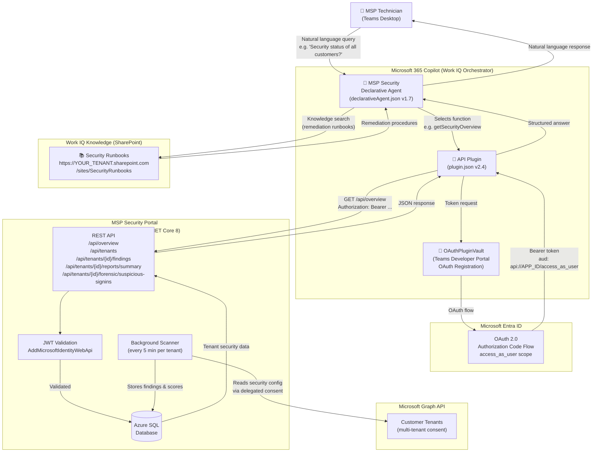

# Architecture Diagram

## MSP Security Copilot Agent — System Architecture

## Key Technology Components

| Component | Technology |
|-----------|-----------|
| Copilot Agent | Microsoft 365 Copilot Declarative Agent (manifest v1.19, agent v1.7) — Work IQ Orchestrator |
| Work IQ Knowledge | SharePoint `OneDriveAndSharePoint` capability — Security Runbooks grounding |
| API Plugin | Teams API Plugin (schema v2.4, OpenAPI 3.0) |
| Authentication | OAuthPluginVault → Microsoft Entra ID OAuth 2.0 (delegated) |
| Backend API | ASP.NET Core 8, `AddMicrosoftIdentityWebApi` JWT validation |
| Data Store | Azure SQL (Entity Framework Core) |
| Infrastructure | Azure VM, Nginx reverse proxy, Let's Encrypt TLS |
| Security Data | Microsoft Graph API (multi-tenant app consent) |

## Authentication Flow

1. User triggers a function via Copilot chat
2. Teams **OAuthPluginVault** initiates OAuth 2.0 Authorization Code flow
3. User authenticates with **Microsoft Entra ID** (single sign-on)
4. Entra issues a delegated token with `access_as_user` scope
5. Copilot includes `Authorization: Bearer <token>` in every API call
6. API validates token audience (`api://<APP_ID>`) via `AddMicrosoftIdentityWebApi`
7. Request is processed and data returned from Azure SQL
